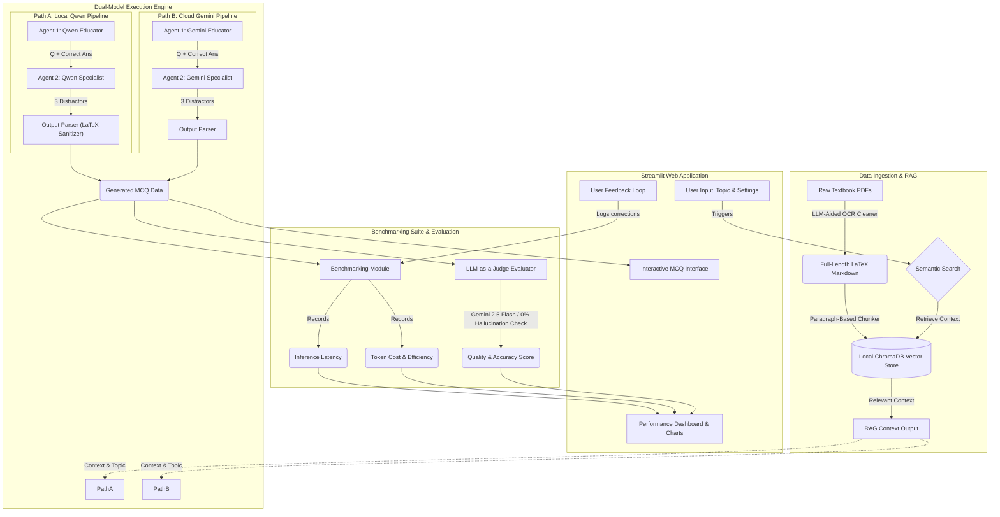

# System Architecture: AI-Powered Benchmarking & Content Generation Dashboard

This document outlines the high-level architecture for the Automated MCQ Generator and LLM Evaluator, centered around an interactive Streamlit application.

## Architecture Map

The following Mermaid diagram illustrates the data flow and component interaction within the system:

## Component Details

### 1. Data Ingestion & RAG Module
- **Purpose**: To provide curriculum-grounded, mathematically perfect context for question generation.
- **Components**:
  - **LLM-Aided OCR Pipeline**: Reads raw PDF files and uses Gemini 2.5 Flash to automatically restore broken mathematical formulas into pristine LaTeX Markdown.
  - **Smart Markdown Chunker**: Splits the generated Markdown specifically by paragraphs (`\n\n`) to guarantee that multi-line formulas and theorems are never fractured.
  - **Embedding Generator**: Converts text chunks into vector embeddings.
  - **ChromaDB Vector Store**: A local vector database that holds all curriculum embeddings and enables fast semantic search based on user-provided topics.

### 2. Dual-Model Execution Engine & Multi-Agent Framework
- **Purpose**: To route the same generation tasks to two different models for comparative benchmarking. The entire multi-agent workflow (Agent 1 & Agent 2) is executed independently on each pipeline to accurately evaluate each model's capability to chain reasoning.
- **Execution Paths**:
  - **Local Pipeline (Qwen2.5-0.5B-Instruct)**: Runs locally via HuggingFace `transformers`. Executes both the Educator (Agent 1) and Misconception Specialist (Agent 2) locally.
  - **Cloud Pipeline (Gemini 2.5 Flash)**: Runs via the Google AI Studio free-tier API. Executes both the Educator (Agent 1) and Misconception Specialist (Agent 2) via the cloud API.
- **Enforcement**: Both pipelines utilize Pydantic schemas to strictly validate and parse the agent responses into a deterministic JSON structure. A custom JSON sanitization step runs on the local model to handle escaped backslashes from LaTeX math.

### 3. Benchmarking & Evaluation Suite
- **Purpose**: To programmatically assess the performance differences between the local open-source model and the commercial cloud model, ensuring a 0% hallucination rate.
- **Metrics Tracked**:
  - **Inference Latency**: Total time taken to generate a full MCQ (Target: p95 latency < 3 seconds).
  - **Token Efficiency**: Input and output token tracking to estimate and compare dollar costs.
  - **Quality Score**: Employs an "LLM-as-a-judge" mechanism (powered by Gemini 2.5 Flash) to verify if the question aligns with the curriculum and if the distractors are logically flawed yet realistic.

### 4. Streamlit User Interface
- **Purpose**: To provide an interactive dashboard for users to generate, test, and evaluate AI-generated educational content.
- **Features**:
  - **Input Section**: UI controls to select math topics and configuration.
  - **Interactive MCQ Interface**: Renders the generated questions for users to interact with.
  - **Performance Dashboard**: Displays visualizations (charts/graphs) comparing latency, cost, and accuracy.
  - **Feedback Loop**: UI elements allowing users to flag incorrect or poor quality content, which logs the feedback for further pipeline improvement.
